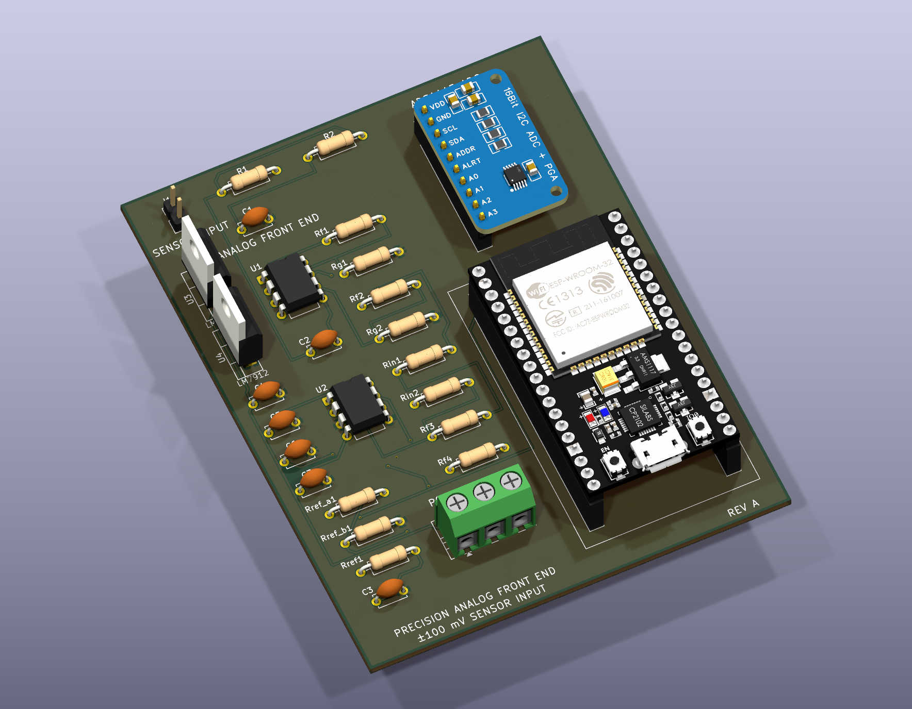
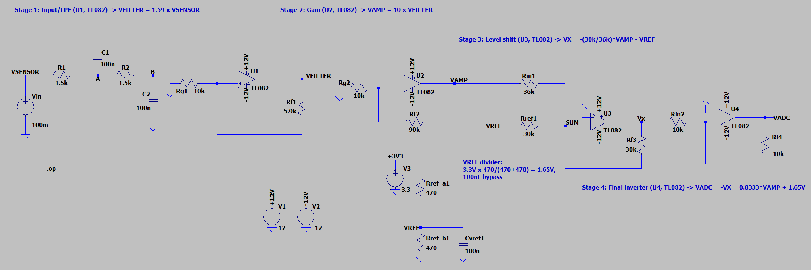
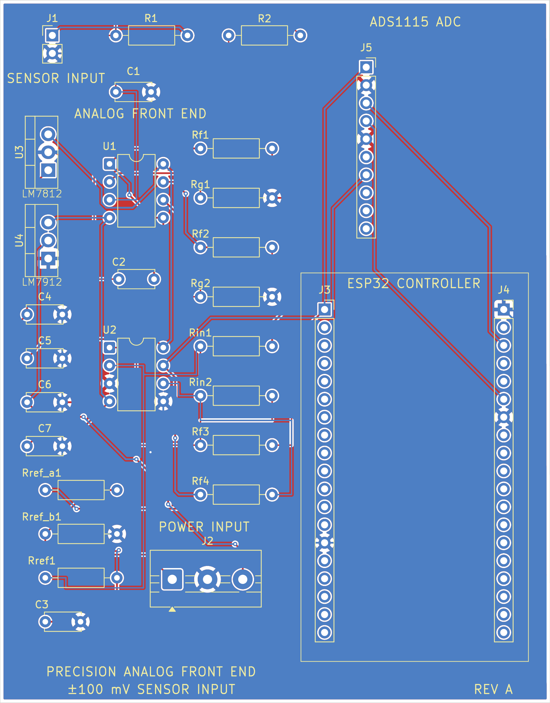

# Precision Mixed-Signal Data Acquisition Front End (AFE)

A four-stage precision analog front end that conditions a ±100 mV bipolar sensor signal into the 0–3.3 V unipolar window of a 16-bit ADS1115 ADC, designed for an ESP32-WROOM-32 host. Designed, simulated in LTspice, and laid out in KiCad. **Not built — no physical hardware exists.**



*Rev A board (78 mm × 100 mm, 2-layer), KiCad 3D render. The physical board has not been manufactured.*

---

## Overview

A sensor that outputs a few tens of millivolts, swinging both positive and negative, cannot be connected to a single-supply ADC. It is too small to use the converter's resolution, it goes below the converter's ground rail, and it carries out-of-band content the converter will alias.

This project is the hardware that sits between the two: an analog front end that band-limits, amplifies, and re-centres the signal so that a 16-bit ADC sees a well-conditioned, in-range voltage, and an ESP32 can read it over I²C.

| | |
|---|---|
| **Input** | ±100 mV bipolar, single-ended (J1) |
| **Output** | 0.31 V … 2.96 V unipolar, centred on VREF (to ADS1115 A0) |
| **Overall gain** | 13.25 V/V (22.4 dB) |
| **Bandwidth** | 2nd-order Butterworth low-pass, f₀ = 1.06 kHz |
| **Analog supply** | ±15 V (unregulated), external via screw terminal (J2); regulated on-board to ±12 V by LM7812 / LM7912 |
| **Digital supply** | 3.3 V from the ESP32 module's on-board regulator |
| **Op-amps** | 2 × TL082 (dual JFET-input), DIP-8 |
| **ADC** | ADS1115 breakout, 16-bit, I²C, ±4.096 V FSR |
| **Board** | 78 mm × 100 mm, 2-layer, 1.6 mm, all through-hole |
| **Status** | Designed · Simulated (DC) · Schematic complete · PCB fully routed with GND pour |

---

## Engineering motivation

Connecting a low-level sensor directly to a microcontroller ADC fails for four independent reasons, and each one needs its own circuit stage:

| Problem | Consequence | Stage that solves it |
|---|---|---|
| Signal is out-of-band above ~1 kHz | High-frequency interference folds back into the measurement band | Stage 1 — Sallen-Key low-pass |
| Signal is ~100 mV into a 4.096 V converter span | Only ~2.4 % of the ADC range is used; quantisation noise dominates | Stage 2 — ×10 gain |
| Signal is bipolar; the ADC ground rail is 0 V | Negative half-cycles are clipped or damage the input | Stage 3 — inverting summing level shift onto VREF |
| The summing stage inverts the signal | Polarity is wrong at the ADC | Stage 4 — unity-gain inverter |

Doing all four in one stage is possible but couples the design decisions together — the gain would set the filter Q, the offset would move with gain, and nothing could be probed independently. Splitting them keeps every design equation independent and gives four testable nodes.

---

## Signal flow

```
                 ±100 mV                  ±159 mV               ±1.59 V
   SENSOR ──▶ ┌───────────┐  VFILTER  ┌───────────┐  VAMP  ┌──────────────┐
   J1         │  STAGE 1  │ ────────▶ │  STAGE 2  │ ─────▶ │   STAGE 3    │
              │ Sallen-Key│           │ Non-inv.  │        │  Inverting   │
              │  LPF ×1.59│           │  amp ×10  │        │  summer      │
              │  U1A      │           │  U1B      │        │  U2A         │
              └───────────┘           └───────────┘        └──────┬───────┘
                                                                  │ VX
                        +3.3 V                                    │ −2.96 … −0.31 V
                          │                                       ▼
                     ┌────┴────┐  VREF = 1.637 V           ┌──────────────┐
                     │ 470/470 │ ─────────────────────────▶│   STAGE 4    │
                     │ divider │                           │ Unity inv.   │
                     │ + 100 nF│                           │  U2B         │
                     └─────────┘                           └──────┬───────┘
                                                                  │ VADC
                                                                  │ 0.31 … 2.96 V
                                                                  ▼
                                                        ┌────────────────────┐
                                                        │ ADS1115  (A0)      │
                                                        │ 16-bit, ±4.096 V   │
                                                        └─────────┬──────────┘
                                                                  │ I²C (SDA/SCL)
                                                                  ▼
                                                        ┌────────────────────┐
                                                        │ ESP32-WROOM-32     │
                                                        └────────────────────┘
```

Full node-by-node breakdown: **[03 — Signal Path](docs/03_Signal_Path.md)**

---

## Key specifications

| Parameter | Design value | Source |
|---|---|---|
| Input range | ±100 mV | Design target (silkscreened on board) |
| Stage 1 passband gain, K | 1 + 5.9k/10k = **1.590** | Calculated, LTspice-confirmed |
| Stage 1 cutoff, f₀ | 1/(2π·1.5k·100n) = **1061 Hz** | Calculated |
| Stage 1 Q | 1/(3 − K) = **0.709** (Butterworth ≈ 0.707) | Calculated |
| Stage 2 gain | 1 + 90k/10k = **10.00** | Calculated, LTspice-confirmed |
| Stage 3 signal gain | −30k/36k = **−0.8333** | Calculated, LTspice-confirmed |
| Stage 3 reference gain | −30k/30k = **−1.000** | Calculated |
| Stage 4 gain | −10k/10k = **−1.000** | Calculated |
| **Total gain, VSENSOR → VADC** | **13.25 V/V** | LTspice: 13.248 V/V |
| VREF (unloaded) | 3.3 × 470/940 = **1.650 V** | Calculated |
| VREF (loaded by Rref1) | **1.637 V** | LTspice: 1.6372 V |
| VADC at −100 mV / 0 / +100 mV | 0.313 / 1.637 / 2.962 V | LTspice (TL082) |
| ADC resolution referred to input | 4.096 V / 2¹⁵ / 13.25 = **9.4 µV/LSB** | Calculated |

---

## Hardware architecture

**Analog section** (left half of the board) — two TL082 dual op-amps in DIP-8 provide the four amplifier stages. All resistors are 1/4 W axial through-hole on a 10.16 mm pitch, arranged in a single labelled column so every feedback network can be identified and swapped without a schematic in hand. Analog supplies enter on a 3-pin 5 mm screw terminal (+15V_RAW / GND / −15V_RAW) from an external bench supply; on-board **LM7812 / LM7912 linear regulators** (U3/U4, with C4–C7 input/output bypass) clean this to the ±12 V the op-amps actually run on. The raw rail needs headroom above 12 V for the regulators to hold regulation, which is why the connector is no longer labelled ±12 V directly.

**Digital section** (right half) — the ESP32 dev board seats in two 1×19 pin sockets and supplies 3.3 V from its own regulator; the ADS1115 breakout seats in a 1×10 socket above it. The two sections meet only at the VADC trace and the shared ground.

Details: **[07 — KiCad Schematic and PCB](docs/07_KiCad_Schematic_and_PCB.md)**

---

## Simulation

Design verification was done in LTspice in two phases.

**Phase 1 — stage development with OP1177.** Each stage was designed, simulated, and iterated on its own bench: the Sallen-Key filter (AC sweep + transient), the ×10 gain stage (AC + transient), the level shifter, and then a two-stage and finally a four-stage integration. This phase used the OP1177 model that ships with LTspice, and produced the resistor values now in the schematic.

**Phase 2 — TL082 substitution.** The physical build targets TL082, so a third-party TL082 PSpice macromodel (`TL082.lib`) was brought in and the full chain re-run against it. The DC transfer at −100 mV / 0 / +100 mV was extracted and matches the ideal transfer function to within 0.02 %.



*Four-stage chain as simulated with the TL082 macromodel.*

| Test condition | Ideal (calculated) | LTspice, TL082 | Δ |
|---|---:|---:|---:|
| VSENSOR = 0 | 1.637 V | 1.63737 V | +0.4 mV |
| VSENSOR = +100 mV | 2.962 V | 2.96220 V | +0.2 mV |
| VSENSOR = −100 mV | 0.313 V | 0.31254 V | −0.2 mV |

**Two simulation issues are open and are not hidden here:** the TL082 build's filter section is wired as a passive two-pole RC rather than the Sallen-Key that is in the KiCad schematic (DC results unaffected, AC results not representative), and the OP1177 reference file no longer runs. Both are documented in **[05 — LTspice Simulation](docs/05_LTspice_Simulation.md)**.

Full detail: **[05 — LTspice Simulation](docs/05_LTspice_Simulation.md)** · **[06 — Simulation Results](docs/06_Simulation_Results.md)**

---

## PCB design



*F.Cu (red), B.Cu (blue — mostly the GND pour), silkscreen and board outline. Fully routed.*

- **78.1 mm × 99.6 mm** bounding box (2 layers, 1.6 mm FR4)
- 29 footprints, all through-hole; 115 pads
- 209 track segments (112 on F.Cu, 97 on B.Cu), ≈1355 mm total; 10 vias (0.6 mm / 0.3 mm drill)
- **GND poured on both F.Cu and B.Cu** (2 zones, 0.25 mm min thickness)
- Design rules: 0.2 mm min clearance, 0.2 mm min track, 0.5 mm copper-to-edge
- **DRC: 0 violations.** **ERC: 0 errors, 32 warnings** (all "label connected to only one pin" — the unused ESP32 GPIO breakout labels)
- No test points; no local decoupling at the op-amp supply pins

**Routing is complete.** Every net — including the seven internal analog nodes (the two filter nodes and the five op-amp inverting-input/feedback nodes) that an earlier netlist-sync bug had left with no copper — now has a fully routed connection, plus a GND pour on both layers. See **[07 — KiCad Schematic and PCB](docs/07_KiCad_Schematic_and_PCB.md)** for the routing table and the story of that bug.

---

## ESP32 + ADS1115 interface

The digital side is a **hardware interface only — no firmware has been written.**

| ADS1115 (J5) | Net | Goes to |
|---|---|---|
| 1 VDD | +3V3 | J3-1 (ESP32 3V3) |
| 2 GND | GND | Board ground |
| 3 SCL | SCL | J4-3 (ESP32 GPIO22) |
| 4 SDA | SDA | J4-6 (ESP32 GPIO21) |
| 5 ADDR | GND | Sets I²C address 0x48 |
| 6 ALRT | — | Not connected |
| 7 A0 | **VADC** | Stage 4 output |
| 8–10 A1–A3 | — | Not connected |

Details: **[09 — ESP32 + ADS1115 Interface](docs/09_ESP32_ADS1115_Interface.md)**

---

## Verification status

| Item | Designed | Simulated | On PCB | Routed | Physically tested |
|---|:--:|:--:|:--:|:--:|:--:|
| Sallen-Key low-pass (U1A) | ✓ | ✓ (AC/transient, OP1177 · DC only, TL082) | ✓ | ✓ | — |
| ×10 gain stage (U1B) | ✓ | ✓ (AC/transient, OP1177 · DC, TL082) | ✓ | ✓ | — |
| Level shifter (U2A) | ✓ | ✓ (DC, TL082) | ✓ | ✓ | — |
| Unity inverter (U2B) | ✓ | ✓ (DC, TL082) | ✓ | ✓ | — |
| 1.65 V reference divider | ✓ | ✓ (DC, TL082, incl. loading) | ✓ | ✓ | — |
| ADS1115 interface | ✓ | — | ✓ | ✓ | — |
| ESP32 interface | ✓ | — | ✓ | ✓ | — |
| ±12 V regulation (LM7812/LM7912) | ✓ | ideal sources only in signal-chain sims | ✓ | ✓ | — |
| Firmware | — | — | — | — | — |

**No physical prototype exists.** The board has not been fabricated, assembled, powered, or measured. Every performance figure in this repository is either a hand calculation or an LTspice result. Physical hardware validation is outside the current project scope.


---

## Engineering challenges

- **Choosing K = 1.59 rather than "gain = 1".** In an equal-component Sallen-Key, the passband gain and the pole Q are the same knob: Q = 1/(3 − K). A unity-gain buffer would give Q = 0.5 (overdamped, soft knee). K = 1.586 is the value that lands Q on 0.7071 — maximally flat. The 5.9 kΩ / 10 kΩ pair gives K = 1.590 and Q = 0.709, 0.3 % from ideal, using stock values.
- **Sizing the level shifter so the extremes stay inside the rail, not just the centre.** An earlier iteration used Rin1 = 20 kΩ. That still centred on 1.65 V at zero input, but the ±100 mV extremes landed at −0.74 V and +4.03 V — outside the ADC's supply rails in both directions. Rin1 = 36 kΩ trades gain for headroom and puts the extremes at 0.31 V / 2.96 V.
- **Predicting the reference divider's error before simulating it.** VREF is not 1.650 V in circuit; Rref1 (30 kΩ) sinks ~55 µA from a 235 Ω source, pulling it to 1.637 V. That 13 mV shift is a fixed offset the firmware can calibrate out — but it had to be identified as a systematic error rather than mistaken for simulation noise.
- **Migrating from a model that exists to a part that can be bought.** OP1177 has a vendor-supplied LTspice model; TL082 does not ship with LTspice. Getting the TL082 macromodel to converge required source stepping, and re-running the chain surfaced the fact that the two integration files had drifted apart.

---

## Current project status

**Designed · Simulated · Schematic complete · PCB placed and fully routed with a GND pour · Documented.**

Not manufactured, not assembled, not physically validated, not production-ready.

---

## Limitations

- No physical prototype; no oscilloscope, multimeter, or spectrum measurements of any kind.
- No local supply decoupling at the TL082 pins, no test points on the current board.
- ±12 V is regulated on-board (LM7812/LM7912), but the input rail is still an external, unregulated ±15 V supply — there is no AC-mains or USB-derived path to that rail.
- The TL082 full-chain simulation covers **DC only**; there is no AC or transient run against the TL082 model, and its filter section does not match the board.
- The AC and transient results in this repository were produced with **OP1177**, not the TL082 that is on the schematic.
- The 1.06 kHz filter corner sits above the ADS1115's 430 Hz Nyquist frequency at its 860 SPS maximum rate — it band-limits the signal but does not anti-alias the converter.
- No input protection, no reverse-polarity protection, no sensor characterisation.
- No firmware.


---

## Future improvements

1. Resolve the two open simulation discrepancies (filter topology in the TL082 file; repair the OP1177 reference bench).
2. Run AC and transient sweeps against the TL082 model and compare to the OP1177 reference.
3. Add 100 nF decoupling at each TL082 supply pin, and test points at VSENSOR / VFILTER / VAMP / VREF / VADC.
4. Fabricate and assemble; bring up the rails before the signal chain.
5. Measure DC transfer, frequency response, and noise floor; compare against simulation.
6. Write ESP32 firmware: I²C driver for the ADS1115, offset/gain calibration, data logging.
7. Revise to Rev B against measured data.

**Done since the last revision of this document:** PCB routing is complete (including seven internal analog nets a netlist-sync bug had silently left unrouted — see [07 §5](docs/07_KiCad_Schematic_and_PCB.md#5-resolution--the-unrouted-nets-and-the-bug-behind-them)), a GND pour was added on both copper layers, and on-board LM7812/LM7912 regulation replaced the external-±12V-only supply architecture.

---

## Repository structure

```
.
├── README.md                     ← this file
├── docs/                         ← full engineering documentation
│   ├── README.md                 ← documentation index
│   ├── 01_Project_Overview.md
│   ├── 02_System_Architecture.md
│   ├── 03_Signal_Path.md
│   ├── 04_Analog_Circuit_Design.md
│   ├── 05_LTspice_Simulation.md
│   ├── 06_Simulation_Results.md
│   ├── 07_KiCad_Schematic_and_PCB.md
│   ├── 08_Components_and_BOM.md
│   ├── 09_ESP32_ADS1115_Interface.md
│   ├── 10_Engineering_Decision.md
│   ├── Portfolio_Summary.md      ← recruiter-facing summary
│   ├── images/                   ← schematic, PCB and LTspice figures
│   └── design_files/             ← generated PDF / BOM exports + source pointers
├── KiCAD_PCB_Design/             ← KiCad 10 project (schematic, PCB, STEP)
├── LTSpice_Simulation/           ← LTspice schematics, netlists, TL082 model
└── Precision DAQ AFE_Documentation/   ← original engineering log / working notes
```

---

## Skills demonstrated

**Analog design** — active filter synthesis (Sallen-Key, Butterworth Q targeting), op-amp gain-stage design, inverting summing amplifiers, level shifting, resistive reference design with loading analysis, supply-rail headroom budgeting.

**Simulation** — LTspice AC / transient / DC-sweep analysis, third-party SPICE macromodel integration, convergence troubleshooting (Gmin and source stepping), model-substitution verification, netlist-level inspection.

**PCB design** — KiCad 10 schematic capture, footprint assignment, through-hole layout, functional block placement, analog/digital section separation, DRC/ERC.

**Mixed-signal / embedded** — external ADC selection and interfacing, I²C bus wiring, ADS1115 address strapping and PGA range selection, ESP32 dev-board integration.

**Engineering process** — requirement-driven stage decomposition, quantitative trade-off analysis, iterative design revision with superseded values preserved, honest separation of calculated / simulated / measured, self-audit of design-file consistency.

---

## Documentation

Start at **[docs/README.md](docs/README.md)** for the full index.

- **[docs/01–09](docs/README.md)** — the technical documentation: overview, architecture, signal path, circuit design, simulation, PCB, BOM, and the ESP32/ADS1115 interface.
- **[docs/10_Engineering_Decision.md](docs/10_Engineering_Decision.md)** — every significant design choice, the alternative it was taken over, and the reasoning.
- **[docs/Portfolio_Summary.md](docs/Portfolio_Summary.md)** — a short, recruiter-facing summary of the same project.
