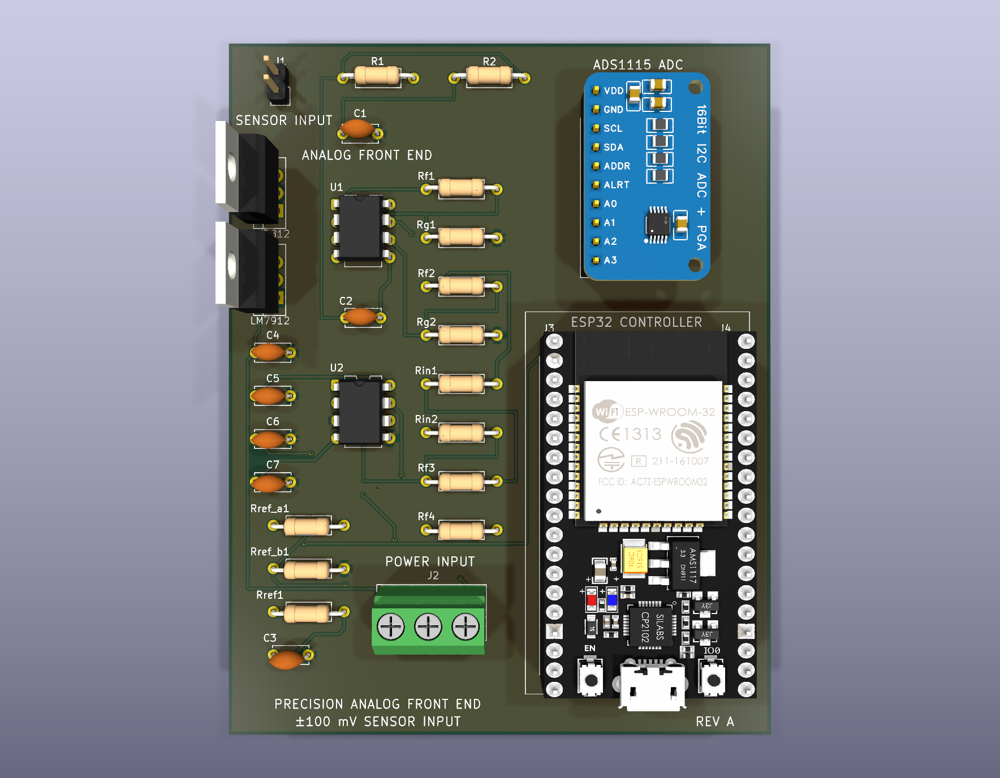

# 02 — System Architecture

[← Documentation index](README.md)

This document describes the system architecture as captured in the KiCad Rev A design (`KiCAD_PCB_Design/Precision_AFE_ESP32.kicad_sch`).

---

## 1. Block diagram

```
 EXTERNAL                  ANALOG SECTION  (±12 V)                    DIGITAL SECTION  (3.3 V)
 ─────────                 ──────────────────────                     ───────────────────────

 Sensor ──▶ J1 ──▶ ┌──────────────┐    ┌──────────────┐    ┌──────────────┐   ┌──────────────┐
 ±100 mV  SENSOR   │   STAGE 1    │    │   STAGE 2    │    │  STAGE 3+4   │   │   ADS1115    │
          INPUT    │  Sallen-Key  │    │  Non-inv.    │    │ Level shift  │   │  16-bit ADC  │
                   │  LPF, K=1.59 │───▶│  amp, ×10    │───▶│  + inverter  │──▶│  A0, ±4.096V │
                   │  f₀=1.06 kHz │    │              │    │ ×0.833 +VREF │   │   J5 socket  │
                   │  U1A (TL082) │    │  U1B (TL082) │    │ U2A,U2B      │   └──────┬───────┘
                   └──────────────┘    └──────────────┘    └──────▲───────┘          │
                          ▲                    ▲                  │              I²C │
                          │                    │                  │           SDA/SCL│
 Bench ──▶ J2 ────────────┴────────────────────┘           ┌──────┴──────┐           │
 ±12 V   POWER            +12 V / −12 V / GND              │ VREF        │           ▼
         INPUT                                             │ 470Ω/470Ω   │   ┌──────────────┐
                                                           │ + 100 nF    │   │ ESP32-WROOM  │
                                                           │ = 1.637 V   │   │   -32 DevKit │
                                                           └──────▲──────┘   │  J3 + J4     │
                                                                  │          └──────┬───────┘
                                                            +3.3 V│                 │ +3.3 V
                                                                  └─────────────────┘
                                                                          ▲
                                                                          │ USB 5 V
```

**Signal chain, in one line:**

`VSENSOR → [Sallen-Key LPF ×1.59] → VFILTER → [Gain ×10] → VAMP → [Inverting summer ×(−0.833), +VREF] → VX → [Unity inverter] → VADC → ADS1115 A0 → I²C → ESP32`

---

## 2. What each block contributes

### Stage 1 — Sallen-Key low-pass filter (U1A)
**Role: Band limiting and providing initial gain.**

This stage places a 2nd-order maximally-flat (Butterworth) corner at 1.06 kHz so that content above the measurement band is attenuated at 40 dB/decade. It is deliberately positioned **before** the main gain stage: filtering high-frequency interference early prevents it from being amplified downstream.

The 1.59× passband gain is an inherent property of this equal-component filter topology. It is the exact value of K required to set Q = 0.707 for Butterworth flatness. I carefully accounted for this within the overall system gain budget. See [04 — Analog Circuit Design](04_Analog_Circuit_Design.md#stage-1).

### Stage 2 — Non-inverting amplifier ×10 (U1B)
**Role: Maximizing ADC span utilisation.**

This stage amplifies the ±159 mV filter output to ±1.59 V. The non-inverting topology was chosen because it presents a high input impedance to the filter, ensuring the filter's transfer function remains unloaded and predictable.

### Stage 3 — Inverting summing amplifier (U2A)
**Role: Bipolar-to-unipolar translation and precise headroom tuning.**

This stage sums the amplified signal with the 1.65 V reference in a single inverting node:
`VX = −(30k/36k)·VAMP − (30k/30k)·VREF`

I selected a 36 kΩ input resistor to scale the signal down by a factor of 0.833. This was a deliberate engineering trade-off designed to keep the final output comfortably within the ADC's voltage limits. See [10 — Engineering Decision](10_Engineering_Decision.md#7-rin1--36-kω--the-headroom-decision).

### Stage 4 — Unity-gain inverter (U2B)
**Role: Polarity correction and low-impedance buffering.**

Because Stage 3 inherently inverts the signal, Stage 4 restores the original polarity. As a result, a rising sensor voltage maps to a rising ADC voltage. Crucially, it also presents a very low-impedance op-amp output to the ADS1115's switched-capacitor input, preventing dynamic settling errors during ADC sampling.

### Reference generator (Rref_a1 / Rref_b1 / C3)
**Role: Establishing the stable centre of the unipolar output window.**

The 1.65 V reference is generated via a 470 Ω / 470 Ω divider driven from the same +3.3 V rail that powers the ADS1115, bypassed with 100 nF. Deriving VREF from the ADC's own supply ensures a ratiometric relationship—any drift in the 3.3 V supply shifts the signal centre and the converter's reference in the same direction, effectively cancelling the error.

### ADS1115 (J5)
**Role: Precision analog-to-digital conversion.** 

This provides 16-bit resolution with a ±4.096 V programmable full-scale range over an I²C interface. It is mounted as a breakout module on a 1×10 socket for easy integration and replacement.

### ESP32-WROOM-32 (J3 / J4)
**Role: System control and digital acquisition.** 

The ESP32 acts as the I²C host and provides the main 3.3 V system rail. It is implemented via a 38-pin dev board footprint on two 1×19 sockets, forming the digital foundation for the system's next integration stage.

---

## 3. Power architecture

The AFE features on-board linear regulation, ensuring the sensitive analog stages operate on exceptionally clean power rails. 

| Rail | Source | Enters via | Consumers |
|---|---|---|---|
| **+15V_RAW** | External bench / lab supply, unregulated | J2 pin 1 (screw terminal) | U3 pin 1 (LM7812 input) |
| **−15V_RAW** | External bench / lab supply, unregulated | J2 pin 3 | U4 pin 2 (LM7912 input) |
| **+12 V** | U3 (LM7812) output | — | U1 pin 8, U2 pin 8 |
| **−12 V** | U4 (LM7912) output | — | U1 pin 4, U2 pin 4 |
| **GND** | External supply, common | J2 pin 2 | Entire board |
| **+3.3 V** | ESP32 dev board's on-board regulator | J3 pin 1 | ADS1115 VDD (J5-1), VREF divider (Rref_a1) |
| **5 V** | ESP32 USB connector | — (not routed on this board) | ESP32 module only |

`VIN_5V` appears as a net on J3 pin 19 but connects to nothing else — it serves as a labelled breakout of the ESP32 header.

The `+12V` and `−12V` nets are actively driven by the U3 and U4 linear regulators, producing a highly stable environment for the dual TL082 op-amps. 

This architecture allows the board to be powered by any standard dual-rail bench supply capable of providing roughly ±15 V. The on-board regulators handle the final drop to ±12 V, isolating the analog section from upstream supply noise. The ESP32 and ADC operate independently off the USB-derived 5 V and 3.3 V rails, physically separating the digital switching currents from the analog supplies.

---

## 4. Grounding architecture

I implemented a **single unified GND net** that spans the entire board — connecting the analog return, reference return, ADC ground, and ESP32 ground at a robust central node tied to the J2 screw terminal.

To provide a very low-impedance return path, **a continuous GND copper pour exists on both layers** (F.Cu and B.Cu, ≈6800 mm² each). Ground is carried by a combination of the pour and 56 discrete GND-net track segments (≈321 mm) that stitch the design together.

Because I finalized the analog/digital physical separation *before* introducing the pour (the analog chain is confined to the left ~39 mm, the ESP32/ADC to the right ~32 mm, separated by a clean ~7 mm corridor), the board intrinsically achieves excellent analog/digital isolation. The comprehensive ground plane simply reinforces this robust layout with a high-quality return path.

---

## 5. Physical partitioning



*The top-down render demonstrates the deliberate physical separation between the sensitive analog front end and the digital processing section.*

| Region | Location | Contents | Silkscreen |
|---|---|---|---|
| Input | Top-left | J1, R1, R2, C1, C2 | `SENSOR INPUT`, `ANALOG FRONT END` |
| Amplifiers | Left-centre | U1, U2 (DIP-8) | `U1`, `U2` |
| Feedback network | Centre column | Rf1, Rg1, Rf2, Rg2, Rin1, Rin2, Rf3, Rf4 | per-resistor refdes |
| Power regulation | Left, below the amplifiers | U3 (LM7812), U4 (LM7912), C4–C7 | `LM7812`, `LM7912` |
| Reference | Bottom-left | Rref_a1, Rref_b1, Rref1, C3 | per-resistor refdes |
| Power entry | Bottom-centre | J2 screw terminal | `POWER INPUT` |
| ADC | Top-right | J5 socket | `ADS1115 ADC` |
| Host | Right | J3, J4 sockets | `ESP32 CONTROLLER` |

I intentionally grouped the eight feedback resistors into a single, clearly labelled column in the centre of the analog section. While this slightly increases trace length, I prioritized this arrangement to make gain values highly visible and easily swappable during hardware bring-up and calibration, reflecting a design optimized for real-world engineering and testing.

---

**Previous:** [01 — Project Overview](01_Project_Overview.md) · **Next:** [03 — Signal Path](03_Signal_Path.md)
