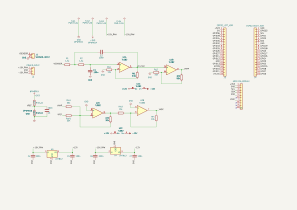

# 03 — Signal Path

[← Documentation index](README.md)

A node-by-node walkthrough of the current Rev A schematic. Every node name below corresponds to the precise net in `Precision_AFE_ESP32.kicad_sch`. Nodes that KiCad leaves unnamed are identified by the intersecting components and are assigned a working name in *italics*.



*Complete Rev A schematic. A PDF version is in [`design_files/`](design_files/).*

---

## Node map

| Node | KiCad net name | Produced by | DC value at VSENSOR = 0 / +100 mV / −100 mV |
|---|---|---|---|
| Sensor input | `VSENSOR` | J1 pin 1 | 0 / +100 mV / −100 mV |
| Filter mid-node | *(unnamed — R1·R2·C2 junction)* | R1 | 0 / +100 mV / −100 mV |
| Filter input node | *(unnamed — R2·C1·U1 pin 3)* | R2 | 0 / +100 mV / −100 mV |
| Filter output | `VFILTER` | U1A pin 1 | 0.017 mV / +159.0 mV / −159.0 mV |
| Amplifier output | `VAMP` | U1B pin 7 | 0.29 mV / +1.590 V / −1.590 V |
| Reference | `VREF` | Rref_a1 / Rref_b1 divider | 1.6372 V (constant) |
| Summing node | *(unnamed — Rin1·Rref1·Rf3·U2 pin 2)* | virtual ground | ≈ 0 V (µV-level) |
| Level-shift output | *(unnamed — Rf3·Rin2·U2 pin 1)*, called **VX** in LTspice | U2A pin 1 | −1.6374 / −2.9622 / −0.3125 V |
| ADC input | `VADC` | U2B pin 7 | 1.6374 / 2.9622 / 0.3125 V |

DC values are derived from LTspice analysis of the TL082 model (`AFE_Integration_TL082`, `.dc` sweep). See [06 — Simulation Results](06_Simulation_Results.md).

---

## 1. `VSENSOR` — sensor input

**Produced by:** External sensor, entering through J1 (2-pin 2.54 mm header; pin 1 = signal, pin 2 = GND).

**Characteristics:** ±100 mV bipolar, single-ended, referenced to board ground. The bandwidth of interest lies below ~1 kHz.

**Engineering context:** At this stage, the sensor drives R1 directly. Future revisions will introduce input protection, series limiting resistors, ESD clamping, and a dedicated anti-alias network ahead of the active filter to robustly handle real-world deployment environments.

**Loading:** The sensor sees R1 = 1.5 kΩ in series with the rest of the filter. At DC, the input impedance is essentially R1 + R2 = 3 kΩ terminating into a high-impedance op-amp node. Sensors with a source impedance that forms a non-negligible fraction of 1.5 kΩ will influence the filter corner and overall gain, which will be characterized during physical testing.

---

## 2. *Filter mid-node* — R1 / R2 / C2 junction

**Produced by:** R1 (1.5 kΩ), driven from VSENSOR.

**Purpose:** This serves as the critical injection point for the Sallen-Key positive feedback. C2 (100 nF) returns here from the op-amp output, establishing the 2nd-order active filter topology rather than two isolated, cascaded RC sections.

**Signal characteristics:** At DC and throughout the passband, this node closely tracks VSENSOR. Because no DC current flows into C2 and only minimal bias current enters the op-amp's JFET input, the DC voltage is preserved. As frequency approaches and exceeds f₀, the bootstrapped feedback through C2 actively raises the impedance at this node, creating the necessary conditions to achieve Q > 0.5.

**Change from previous node:** Essentially identical at DC; increasingly phase-shifted and dynamically shaped as frequency rises.

---

## 3. *Filter input node* — R2 / C1 / U1 pin 3

**Produced by:** R2 (1.5 kΩ).

**Purpose:** This node feeds the non-inverting input of U1A and serves as the shunt point for C1 (100 nF) to ground, forming the second of the two filter poles.

**Signal characteristics:** At DC, this equals VSENSOR (LTspice confirms 99.99987 mV for a 100 mV input). At high frequencies, C1 effectively shorts this node to ground, causing the op-amp output to heavily attenuate out-of-band signals.

**Change from previous node:** Introduces a single-pole RC roll-off relative to the mid-node, which is elevated to a 2nd-order response by the C2 feedback loop.

---

## 4. `VFILTER` — Sallen-Key output

**Produced by:** U1A pin 1 (TL082 unit A).

**Purpose:** Delivers the band-limited, moderately amplified signal. This is the first node where the signal exists at a defined, buffered, low-impedance level, ready for downstream processing.

**Transfer from VSENSOR:**

```
                        K · ω₀²
H(s)  =  ──────────────────────────────────
          s²  +  (ω₀/Q)·s  +  ω₀²

K  = 1 + Rf1/Rg1 = 1 + 5.9k/10k = 1.590
ω₀ = 1/(R·C)     = 1/(1.5 kΩ · 100 nF) = 6666.7 rad/s   →  f₀ = 1061 Hz
Q  = 1/(3 − K)   = 1/(3 − 1.590) = 0.709
```

**Signal characteristics:** Provides ±159 mV in the passband. Attenuates at a steep 40 dB/decade above 1.06 kHz. Achieves a maximally flat (Butterworth) response with no passband peaking.

**Change from previous node:** The signal is intentionally amplified by 1.59×, and spectral content above ~1 kHz is cleanly removed.

**Also connects to:** Rf1 (feedback to U1A pin 2), C2 (Sallen-Key active feedback), and U1 pin 5 (the high-impedance non-inverting input of the subsequent gain stage).

---

## 5. *U1A inverting node* — Rf1 / Rg1 / U1 pin 2

**Produced by:** The Rf1 (5.9 kΩ) / Rg1 (10 kΩ) resistive divider from VFILTER to ground.

**Purpose:** This precisely sets the passband gain K, and directly dictates the filter's Q factor. 

**Signal characteristics:** VFILTER × 10/15.9 = VFILTER × 0.629 — which, maintained by the op-amp's virtual short, precisely mirrors the voltage at pin 3. At +100 mV in, this node tracks at ≈ +100 mV.

---

## 6. `VAMP` — amplifier output

**Produced by:** U1B pin 7 (TL082 unit B), operating as a non-inverting amplifier.

**Gain:** `1 + Rf2/Rg2 = 1 + 90 kΩ/10 kΩ = 10.00`

**Signal characteristics:** Outputs ±1.590 V in the passband, maintaining bipolarity centered on 0 V. The peak-to-peak swing is 3.18 V. Operating on ±12 V rails ensures vast headroom — the TL082 can swing to roughly ±10 V, providing exceptional dynamic range.

**Change from previous node:** Amplified by precisely 10×; shape, polarity, and DC center remain perfectly preserved.

**Engineering rationale for placement:** Positioning the filter *before* this main gain block ensures out-of-band interference is attenuated before multiplication. If the order were reversed, a 500 mV high-frequency transient would become 5 V at the amplifier output, potentially causing severe clipping and distortion before the filter could process it.

---

## 7. `VREF` — 1.65 V reference

**Produced by:** Rref_a1 (470 Ω) and Rref_b1 (470 Ω) forming a precise divider from the +3.3 V rail, heavily bypassed by C3 (100 nF).

**Ideal value:** `3.3 V × 470/(470 + 470) = 1.650 V`, with a Thévenin source impedance of `470 ∥ 470 = 235 Ω`.

**Actual value in circuit: 1.637 V.** Rref1 (30 kΩ) bridges VREF to the virtual ground of U2A, meaning the divider continuously sources current:

```
I  =  1.65 V / 30 kΩ  ≈  55 µA
ΔV =  55 µA × 235 Ω   ≈  12.9 mV       →   VREF ≈ 1.637 V
```

LTspice confirms this loading effect accurately at **1.6372 V**. This represents a systematic, constant, and fully predictable offset, seamlessly correctable via a standard one-point firmware calibration rather than an uncontrolled error.

**Design intent:** Deriving VREF directly from the ADS1115's own +3.3 V supply creates a ratiometric architecture. If the 3.3 V rail drifts, the signal's center point and the converter's measurement reference shift in tandem, elegantly canceling out power supply variations.

---

## 8. *Summing node* — Rin1 / Rref1 / Rf3 / U2 pin 2

**Produced by:** Three independent currents converging at the inverting input of U2A, with the non-inverting input securely tied to ground.

**Purpose:** This is the core junction where the signal and DC reference are gracefully combined. It functions as a **virtual ground** — the op-amp actively holds it at ≈ 0 V via feedback (LTspice confirms 12–24 µV across the full sweep), guaranteeing that the three interfacing resistors operate without mutual interference.

**Current analysis:**

```
I_signal = VAMP / 36 kΩ        (from the amplifier stage)
I_ref    = VREF / 30 kΩ        (from the reference generator)
I_fb     = −VX  / 30 kΩ        (from the output, actively restoring balance)
```

Because this node is rigidly held at 0 V, the signal and reference paths are perfectly decoupled. Adjusting the reference does not alter the signal gain, and vice versa. This independence heavily influenced the choice of a summing amplifier over a passive resistive offset injected at the prior stage.

---

## 9. **VX** — level-shift output

**Produced by:** U2A pin 1. *(Unnamed in KiCad — `Net-(Rf3-Pad1)`. Referenced as `VX` in LTspice and throughout this documentation.)*

**Transfer equation:**

```
VX = −(Rf3/Rin1)·VAMP − (Rf3/Rref1)·VREF
   = −(30k/36k)·VAMP − (30k/30k)·VREF
   = −0.8333·VAMP − VREF
```

**Signal characteristics:** The signal is now effectively unipolar, albeit inverted. At VSENSOR = 0, it rests at −1.637 V; at +100 mV it extends to −2.962 V; at −100 mV it retracts to −0.313 V. The total operational span is tightly controlled between −0.31 V and −2.96 V.

**Change from previous node:** Scaled by a deliberate factor of 0.833, inverted in polarity, and mathematically shifted onto a −VREF bias.

**Design rationale for 0.833 gain:** Implementing a gain of 1.0 would push the output span to ±1.59 V around 1.65 V (i.e., 0.06 V to 3.24 V), consuming almost all available headroom against the 3.3 V rail. Scaling by 0.833 optimally centers the extremes at 0.31 V and 2.96 V, securing a robust ~0.3 V safety margin at both ends to absorb op-amp offsets, resistor tolerances, and supply fluctuations. For an in-depth analysis of this critical decision, refer to [10 — Engineering Decision](10_Engineering_Decision.md#7-rin1--36-kω--the-headroom-decision).

---

## 10. *U2B inverting node* — Rin2 / Rf4 / U2 pin 6

**Produced by:** VX traversing Rin2 (10 kΩ), balanced by Rf4 (10 kΩ) feedback.

**Purpose:** Sets the precise unity gain of the final inversion stage, operating as another highly stable virtual ground.

---

## 11. `VADC` — ADC input

**Produced by:** U2B pin 7.

**Transfer equation:**

```
VADC = −VX  =  0.8333·VAMP + VREF  =  13.25 · VSENSOR + 1.637 V
```

**Signal characteristics:**

| VSENSOR | VADC (calculated) | VADC (LTspice, TL082) |
|---:|---:|---:|
| −100 mV | 0.313 V | **0.31254 V** |
| 0 | 1.637 V | **1.63737 V** |
| +100 mV | 2.962 V | **2.96220 V** |

The full signal span is an optimized **2.650 V**, positioned flawlessly within the ADS1115's 0–3.3 V operational window. It maintains ≈ 0.31 V of clearance from ground and ≈ 0.34 V from the positive supply.

**Change from previous node:** Polarity is successfully restored to match the physical sensor, and the signal is robustly buffered by the op-amp output. This guarantees the ADS1115's switched-capacitor sampling network is driven by a very low source impedance, preventing settling errors.

**Goes to:** J5 pin 7 (ADS1115 channel A0).

---

## 12. Gain budget, end to end

| Stage | Gain | Cumulative | Signal at ±100 mV in |
|---|---:|---:|---|
| Input (VSENSOR) | — | 1.000 | ±100 mV |
| Stage 1 — Sallen-Key | ×1.590 | 1.590 | ±159.0 mV |
| Stage 2 — ×10 amplifier | ×10.00 | 15.90 | ±1.590 V |
| Stage 3 — summing shifter | ×(−0.8333) | −13.25 | −1.325 V about −VREF |
| Stage 4 — unity inverter | ×(−1.000) | **+13.25** | ±1.325 V about +VREF |
| **VADC** | | | **0.313 … 2.962 V** |

`20·log₁₀(13.25) = 22.4 dB`

**Resolution referred to the input:** By utilizing the ADS1115's ±4.096 V PGA range, one LSB represents `4.096 V / 2¹⁵ = 125 µV`. Dividing this by the AFE's signal gain reveals an exceptional resolution of **9.4 µV per LSB at the sensor terminals** — a 13.25× improvement over a direct sensor-to-ADC connection. The complete ±100 mV input sweep intelligently utilizes roughly 21,200 unique ADC codes, maximizing the converter's dynamic range.

---

**Previous:** [02 — System Architecture](02_System_Architecture.md) · **Next:** [04 — Analog Circuit Design](04_Analog_Circuit_Design.md)
