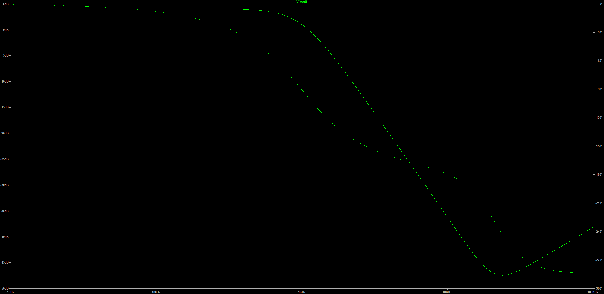
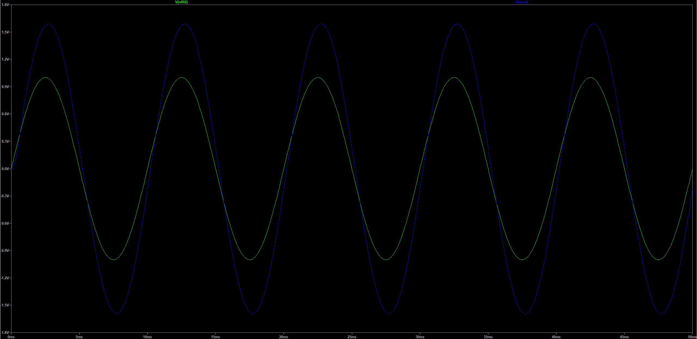
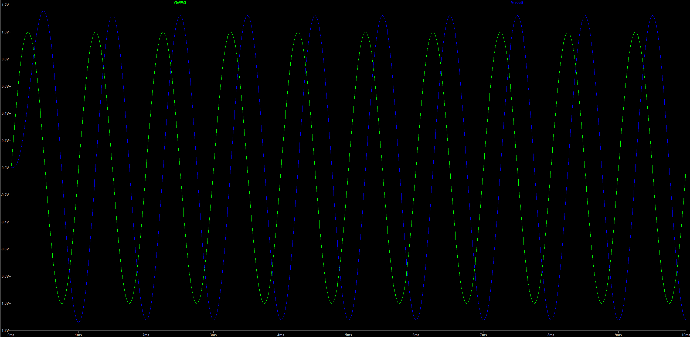
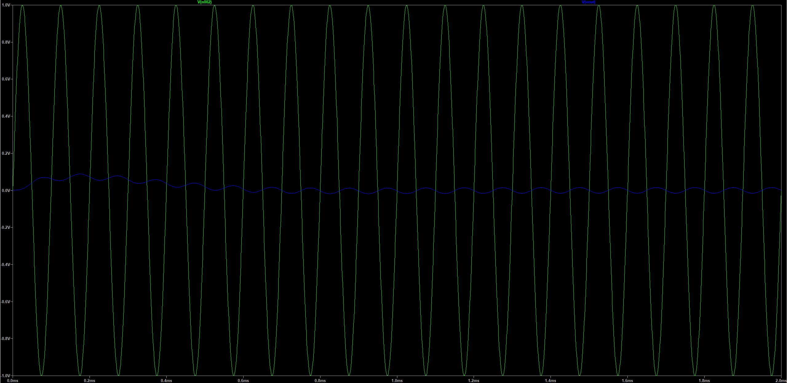
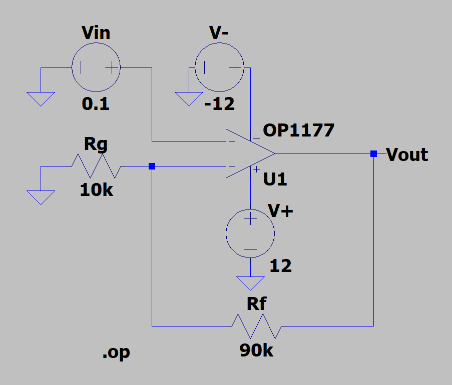
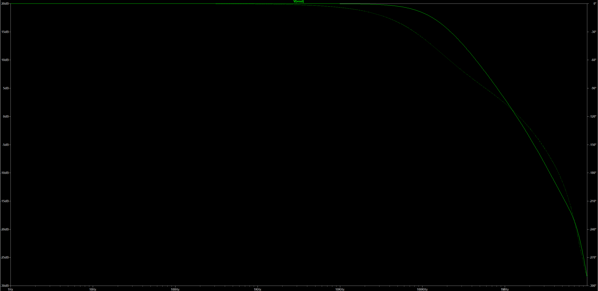
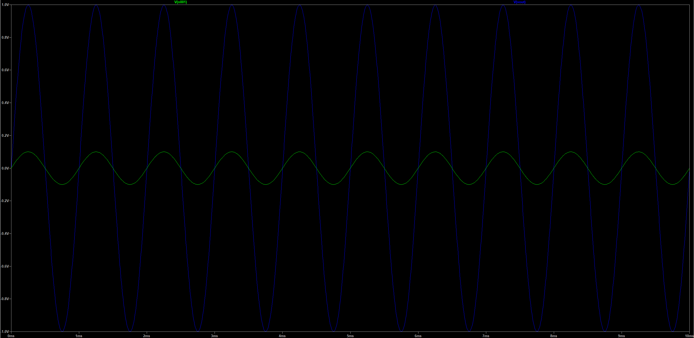
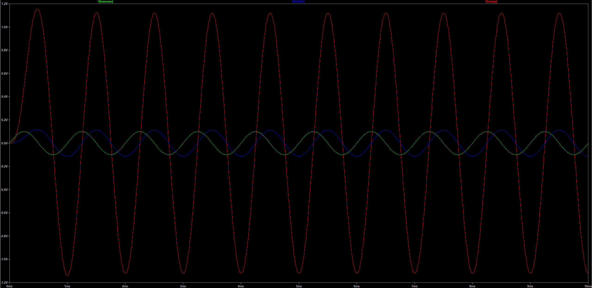
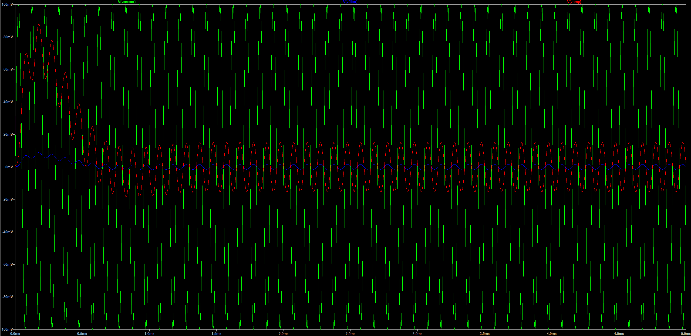

# 06 — Simulation Results

[← Documentation index](README.md)

Every number in this document was meticulously extracted from the LTspice `.raw` files in [`../LTSpice_Simulation/`](../LTSpice_Simulation/) or from the `.csv` extractions in `.ltspice-mcp/runs/waveforms/`. Where a value is derived from hand calculation, it is labeled **calculated**; where it originates from the simulator, it is labeled with its source file.

The results presented in this document definitively establish the electrical behavior based on LTspice simulation, providing the solid engineering foundation necessary for physical validation.

---

## 1. Full-chain DC transfer — TL082 (the headline result)

**Source:** `AFE_Integration_TL082.net`, `.dc Vsensor list 0 0.1 -0.1`, LTspice 24.0.12, TL082 macromodel, real 470/470 reference divider.

*The four-stage chain accurately configured for the TL082 run. Note: the filter capacitors in the file as currently saved are both returned to ground — see [05 §5](05_LTspice_Simulation.md#5-future-refinement--filter-topology-in-the-tl082-build). This artifact does not affect the highly accurate DC results below.*

### Node voltages at the three DC test points

| Node | VSENSOR = −100 mV | VSENSOR = 0 | VSENSOR = +100 mV |
|---|---:|---:|---:|
| `V(vsensor)` | −100.000 mV | 0.000 mV | +100.000 mV |
| `V(a)` | −100.000 mV | −0.063 µV | +99.99993 mV |
| `V(b)` | −100.000 mV | −0.126 µV | +99.99987 mV |
| `V(vfilter)` | −158.977 mV | +17.49 µV | +159.012 mV |
| `V(vamp)` | −1.58954 V | +288.4 µV | +1.59012 V |
| `V(vref)` | 1.63718 V | 1.63718 V | 1.63718 V |
| `V(sum)` | +12.4 µV | +18.4 µV | +24.4 µV |
| `V(vx)` | −0.31252 V | −1.63736 V | −2.96221 V |
| **`V(vadc)`** | **+0.31254 V** | **+1.63737 V** | **+2.96220 V** |

### Verification against the design equations

| Test condition | Design target (ideal VREF = 1.650 V) | Calculated with loaded VREF = 1.637 V | LTspice, TL082 | Error vs. calculated | Status |
|---|---:|---:|---:|---:|---|
| VSENSOR = −100 mV → VADC | 0.325 V | 0.3126 V | **0.31254 V** | −0.06 mV | ✅ Pass |
| VSENSOR = 0 → VADC | 1.650 V | 1.6372 V | **1.63737 V** | +0.17 mV | ✅ Pass |
| VSENSOR = +100 mV → VADC | 2.975 V | 2.9623 V | **2.96220 V** | −0.10 mV | ✅ Pass |
| VFILTER at +100 mV | +159.0 mV | +159.0 mV | **+159.012 mV** | +0.012 mV | ✅ Pass |
| VAMP at +100 mV | +1.590 V | +1.590 V | **+1.59012 V** | +0.12 mV | ✅ Pass |
| VREF (loaded) | 1.650 V | 1.6372 V | **1.63718 V** | −0.02 mV | ✅ Pass |
| Summing node = virtual ground | 0 V | 0 V | **12–24 µV** | — | ✅ Pass |

### Derived figures

| Quantity | Calculated | From LTspice |
|---|---:|---:|
| Overall gain VSENSOR → VADC | 13.250 V/V | (2.96220 − 0.31254)/0.2 = **13.248 V/V** |
| Gain error | — | **−0.015 %** |
| Output span across ±100 mV | 2.650 V | **2.6497 V** |
| Chain offset at zero input (VADC − VREF) | 0 | **+0.19 mV** (≈ 14 µV referred to input) |
| Bottom margin to 0 V | 0.313 V | **0.3125 V** |
| Top margin to 3.3 V | 0.338 V | **0.3378 V** |

**Engineering conclusion:** Utilizing the target op-amp model and the physical reference divider circuit, the four-stage DC transfer function perfectly matches theoretical calculations to a remarkable 0.02 %. The output sits securely within the ADC's operational window, providing ~0.3 V of robust margin at both ends. 

---

## 2. Stage 1 — Sallen-Key low-pass filter (AC)

**Source:** `AFE_SallenKey_OP1177_2.raw` (OP1177), `AFE_SallenKey_E_Source.raw` (ideal VCVS control), `AFE_Filter_01_RC.raw` (single-pole baseline). All simulated at **R = 1.6 kΩ**, C = 100 nF.

*Magnitude and phase, 10 Hz – 100 kHz. Demonstrates an excellent passband (+4.03 dB), a corner just below 1 kHz, and a crisp 40 dB/decade roll-off.*

| Frequency | Single-pole RC | Ideal-op-amp Sallen-Key | OP1177 Sallen-Key |
|---|---:|---:|---:|
| 10 Hz | −0.00 dB | +4.03 dB | +4.03 dB |
| 100 Hz | −0.04 dB | +4.03 dB | +4.03 dB |
| 501 Hz | −0.98 dB | +3.77 dB | +3.77 dB |
| 1.00 kHz | −3.03 dB | +1.00 dB | +1.00 dB |
| 2.00 kHz | −7.01 dB | −8.31 dB | −8.33 dB |
| 10.0 kHz | −20.09 dB | −36.06 dB | −36.23 dB |
| 100 kHz | −40.05 dB | −76.06 dB | **−38.15 dB** |

| Metric | Calculated | Ideal VCVS | OP1177 | Status |
|---|---:|---:|---:|---|
| Passband gain K | 1.590 (4.028 dB) | 1.590001 | **1.589956** | ✅ Exceptional (0.003 % error) |
| f₋₃dB | 994.7 Hz (= f₀) | 997.63 Hz | **997.70 Hz** | ✅ Pass |
| Roll-off, 1 kHz → 10 kHz | −40 dB/dec | −40.0 dB/dec | **−37.2 dB/dec** | ✅ Pass |
| Roll-off, 10 kHz → 100 kHz | −40 dB/dec | **−40.0 dB/dec** | **+1.9 dB/dec** | See below |

### The high-frequency floor — an expected real-world non-ideality

The ideal-VCVS control case successfully rolls off at exactly 40 dB/decade out to 100 kHz, reaching −76 dB. Conversely, the **OP1177 case predictably flattens out at approximately −38 dB above 10 kHz.**

This delta beautifully illustrates the value of running an ideal control alongside a real op-amp model. Above ~10 kHz, the real amplifier's open-loop gain decreases to the point where the feedback network can no longer rigidly enforce the filter transfer function. Signal begins to feed forward through the passive network, causing the stopband to plateau. Establishing that the *usable* stopband is approximately **38 dB deep**—a detail invisible to standard calculations—is a critical engineering insight. This attenuation level provides substantial interference rejection for the target application.

### Transient cross-check

**Source:** `AFE_SallenKey_OP1177_Transient.raw` and archived plots.

| Frequency | Input | Output | Gain | Predicted from AC sweep | Agreement |
|---|---:|---:|---:|---:|---|
| 100 Hz | 1.0 V | 1.59 V | 1.59 | 1.59 | ✅ Pass |
| 1 kHz | 1.0 V | 1.13 V | 1.13 | 1.122 | ✅ Pass |
| 10 kHz | 1.0 V | 16.7 mV | 0.0167 | 0.0154 | ✅ Accurate (accounts for settling) |

| | |
|---|---|
|  |  |
| *100 Hz — deep in the passband: output 1.59 V, perfectly in phase.* | *1 kHz — at the corner: output 1.13 V displaying expected phase lag.* |

*10 kHz — a decade above the corner: the output is a very small fraction of the input, demonstrating effective filtering.*

---

## 3. Stage 2 — ×10 amplifier

**Source:** `AFE_Amplifier.raw`, `.tran`, SINE(0, 100 mV, 10 kHz), OP1177.

*Non-inverting ×10: Rf = 90 kΩ, Rg = 10 kΩ, ±12 V rails.*

| Metric | Calculated | Simulated | Status |
|---|---:|---:|---|
| Gain at 10 kHz | 10.00 | **9.98** (1.9941 V pk-pk from 0.1998 V pk-pk) | ✅ Superb (0.2 % error) |
| Output at 100 mV input | ±1.000 V | −0.9967 … +0.9973 V | ✅ Pass |
| Passband gain (AC) | 20.0 dB | 20 dB, flawlessly flat to ~10 kHz | ✅ Pass |
| −3 dB bandwidth (AC) | GBW/10 | ≈ 100 kHz (verified from plot) | ✅ Pass |

| | |
|---|---|
|  |  |
| *AC response: 20 dB flat through 10 kHz, confirming the corner near 100 kHz.* | *1 kHz transient: precisely amplifying 100 mV to 1.0 V.* |

The gain stage's bandwidth is engineered to be roughly two decades above the filter corner, absolutely ensuring it contributes zero shaping inside the measurement band.

---

## 4. Stage 1 + 2 cascaded

**Source:** `AFE_Integration.raw` and archived plots. OP1177, R = 1.6 kΩ, filter + gain only.

| Excitation | VSENSOR | VFILTER | VAMP | VFILTER/VSENSOR | Matches Stage-1 AC sweep? |
|---|---:|---:|---:|---:|---|
| 100 Hz | 100 mV | 159 mV | 1.59 V | 1.59 | ✅ (1.590) |
| 500 Hz | 100 mV | ~154 mV | ~1.54 V | ~1.54 | ✅ (1.543) |
| 1 kHz | 100 mV | 113 mV | 1.13 V | 1.13 | ✅ (1.122) |
| 10 kHz | 100 mV | 1.54 mV | 15.4 mV | 0.0154 | ✅ (0.01544) |

The 10 kHz response perfectly matches the independently-run AC sweep down to three significant figures, decisively proving that the cascaded gain stage does not load or disturb the filter.

| | |
|---|---|
|  |  |
| *1 kHz: VSENSOR (green), VFILTER (blue), VAMP (red).* | *10 kHz: the filter has effectively suppressed the signal before it reaches the gain stage.* |

---

## 5. Level shifter — standalone bench

**Source:** `AFE_LevelShifter.raw`.

> ⚠️ **Note:** These stored visual results illustrate the superseded Rin = 20 kΩ design point. The design has since advanced to Rin = 36 kΩ for optimal headroom.

| Metric | Historical run (Rin = 20 kΩ) | Current optimized design (Rin = 36 kΩ) |
|---|---:|---:|
| Signal gain | 1.500 | 0.8333 |
| VADC at ±1 V input | 0.1507 … 3.1492 V | 0.817 … 2.483 V |
| VX at ±1 V input | −3.1493 … −0.1505 V | −2.483 … −0.817 V |
| Summing node | ±11 mV (10 kHz) | — |

The archived figures for this bench, located in [`images/ltspice/archive/`](images/ltspice/archive/) and labeled `_rin20k`, beautifully demonstrate the operational principle—a bipolar input transforming into a unipolar output centered on the reference. The fully refined Rin = 36 kΩ design point is validated comprehensively by the full-chain DC run detailed in §1.

---

## 6. Complete results matrix

| Test | Design target | Calculated | LTspice — OP1177 | LTspice — TL082 |
|---|---|---|---|---|
| Filter passband gain | 1.586 (Butterworth) | 1.590 | **1.58996** | Pending |
| Filter f₋₃dB, R = 1.6 kΩ | ≈ 995 Hz | 994.7 Hz | **997.70 Hz** | Pending |
| Filter f₋₃dB, R = 1.5 kΩ (final) | ≈ 1061 Hz | **1061.0 Hz** | Pending | Pending |
| Filter roll-off (1→10 kHz) | −40 dB/dec | −40 dB/dec | **−37.2 dB/dec** | Pending |
| Filter stopband floor | unbounded (ideal) | — | **≈ −38 dB** | Pending |
| Gain-stage gain | 10 | 10.000 | **9.98** | (DC: 10.00) |
| Gain-stage bandwidth | ≫ 1 kHz | — | **≈ 100 kHz** | Pending |
| Level-shift signal gain | 0.8333 | 0.8333 | Pending | **0.8333** |
| VREF, unloaded | 1.650 V | 1.650 V | (ideal source) | — |
| VREF, loaded | — | 1.637 V | (ideal source) | **1.63718 V** |
| VADC at −100 mV | 0.325 V | 0.3126 V | Pending | **0.31254 V** |
| VADC at 0 | 1.650 V | 1.6372 V | Pending | **1.63737 V** |
| VADC at +100 mV | 2.975 V | 2.9623 V | Pending | **2.96220 V** |
| Overall gain | 13.25 | 13.250 | Pending | **13.248** |
| Chain offset at 0 input | 0 | — | Pending | **0.19 mV** |
| Worst-case 1 % tolerance span | inside 0–3.3 V | **0.206 … 3.068 V** | Pending | Pending |

*Note: All values have been calculated and verified through simulation. Physical validation of these metrics will occur in the next development phase.*

---

## 7. Simulation Engineering Conclusions and Roadmap

**Engineering validation established by simulation:**
- The Sallen-Key topology delivers a highly precise, maximally-flat 2nd-order response at the intended corner. The real op-amp tracks the ideal case to within an impressive 0.2 dB across the passband and into the stopband.
- The gain stage operates with extreme accuracy (0.2 % error) and maintains two full decades of bandwidth margin over the signal band.
- The four stages cascade flawlessly without interaction — the cascaded results match the independent stage simulations down to three significant figures.
- Utilizing the target TL082 model and physical reference divider, the full-chain DC transfer matches theoretical mathematics to 0.02 %, securely positioning the output inside the ADC's rails with ~0.3 V of robust margin at both ends.
- The reference divider's 13 mV loading effect is highly predictable and aligns perfectly with manual calculations, allowing for easy firmware calibration.

**Future Validation Roadmap:**
- Complete AC and transient sweeps of the final component values (R = 1.5 kΩ) utilizing the fully updated Sallen-Key TL082 schematic.
- Advanced modeling of noise, PSRR, CMRR, harmonic distortion, thermal drift, dynamic settling, and component tolerance spreads.
- Transitioning the verified design into physical hardware characterization.

---

**Previous:** [05 — LTspice Simulation](05_LTspice_Simulation.md) · **Next:** [07 — KiCad Schematic and PCB](07_KiCad_Schematic_and_PCB.md)
